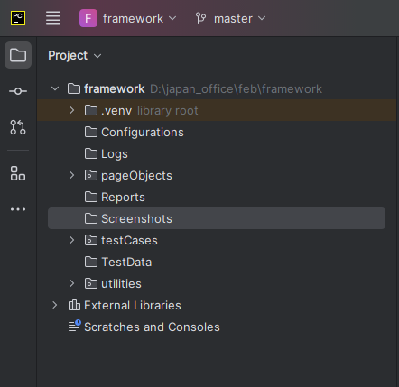

# Selenium Hybrid Framework
### (Python, Selenium, PyTest, Page Object Model, HTML Report)

**Step 1: Create new project and install required packages/plugins in PyCharm**

-   Selenium: Selenium libraries
-   pytest: Python UnitTest framework
-   pytest-html: PyTest HTML Reports
-   pytest-xdist: Run Tests parallel
-   Openpyxl: MS Excel Support
-   Allure-pytest: To generate allure reports

**Step 2: Create Folder structure**
Project Name
\|
pageObjects(Package)

\|

testCases(Package)

\|

utilities(Package)

\|

TestData(Folder)

\|

Configurations(Folder)

\|

Logs(Folder)

\|

Screenshots(Folder)

\|

Reports(Folder)

\|

Run.bat

**Step 3: Automating Login Test Case:**

3.1: Create LoginPage Object Clas under "pageObjects"
    
3.2: Create LoginTest under "testCases"
    
3.3: Create configtest.py under "testCases"

**Step 4: Capture screenshot on failures**

4.1: Update Login Test with Screenshot under "testCases"

**Step 5: Read common values from ini file.**

5.1: Add "Config.ini" file in configuration folder. (Contains credentials)

5.2: Create "readProperties.py" utility file under utilities package to read common data from config.ini file

5.3: Replace hard coded values in Login test case to dynamic.

**Step 6: Adding logs to test case**

6.1: Add customLogger.py in utilities package

6.2: Add logs to Login test case

**Step 7: Run tests parallel**

To run parallel:

    pytest -v -s -n=2 D:\\japan_office\\feb\\framework\\testCases\\test_login.py

**Step 8: Generate pytest HTML Reports**

8.1: Update configtest.py with pytest hooks

8.2: To generate HTML report run below command:

    pytest -v -s -n=2 \--html=Reports/report.html testCases/test_login.py

**Step 9: Automating Data Driven Test Case**

9.1: Prepare test data in Excel sheet, place that excel file in TestData folder.

9.2: Create "ExcelUtil.py" utility class under utilities package.

**Step 10: Adding new Testcases**
1)  Buy the products:
    1.  Add to cart
    2.  Checkout
    3.  Generate First, Last name and Pincode
    4.  Print Total Price
    5.  Confirm the Order

**Step 11: Grouping Tests**

11.1: Grouping markers[Add markers to every test method]
    
    @pytest.mark.regression
    
    @pytest.mark.sanity

11.2: Add marker entries in pytest.ini file

**Pytest.ini**
    
    [pytest]
    
    markers=
        
        sanity
        
        regression

11.3: Select groups at run time
    
    pytest -s -v -m "sanity"
    
    pytest -s -v -m "regression"
    
    pytest -s -v -m "sanity and regression"
    
**Step 12: Run tests in command prompt & run.bat file**

12.1: Create run.bat file (‘rem’ used to comment)

    pytest -s -v -m "sanity" 

    rem pytest -s -v -m "regression"

    rem pytest -s -v -m "sanity and regression"

12.2 Open command prompt as Admin and then run run.bat file
